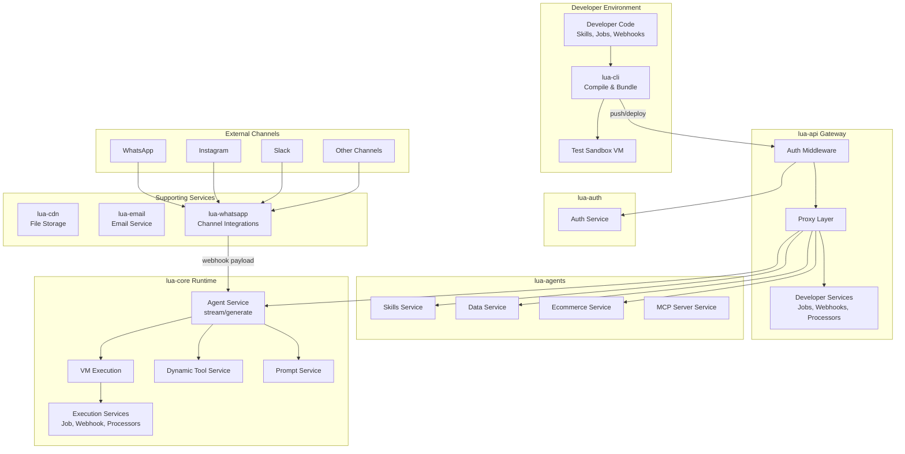
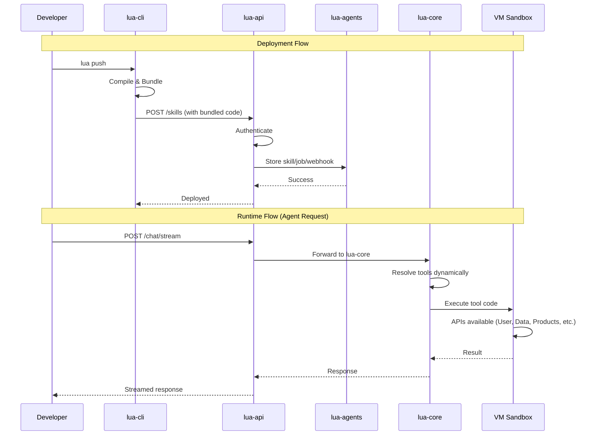

# Lua CLI Development Guide

A comprehensive guide for developers and AI assistants working on features and updates in the lua-cli ecosystem.

> ⚠️ **Important:** After every change to lua-cli, remember to update **lua-dev-docs** (public developer documentation). See [Documentation Checklist](#documentation-checklist-always-do-this).

## Table of Contents

1. [Architecture Overview](#architecture-overview)
2. [Repository Structure](#repository-structure)
3. [Adding a New Primitive](#adding-a-new-primitive)
4. [Modifying an Existing Primitive](#modifying-an-existing-primitive)
5. [Adding a New API](#adding-a-new-api)
6. [Modifying an Existing API](#modifying-an-existing-api)
7. [Adding New CLI Commands](#adding-new-cli-commands)
8. [Key Patterns](#key-patterns)
9. [Checklists](#checklists)
10. [Example Walkthroughs](#example-walkthroughs)
11. [Commit Message Conventions](#commit-message-conventions)

---

## Architecture Overview

The Lua platform is a multi-repository system for building and deploying AI agents. Code written by developers using lua-cli gets compiled, bundled, and executed at runtime by lua-core.

### System Architecture Diagram



### Request Flow Diagram



---

## Repository Structure

### lua-cli

The command-line tool for building and deploying Lua agents.

```
lua-cli/
├── src/
│   ├── api/                    # API services (HTTP-based, for test sandbox)
│   │   ├── user.data.api.service.ts
│   │   ├── products.api.service.ts
│   │   ├── basket.api.service.ts
│   │   ├── order.api.service.ts
│   │   ├── custom.data.api.service.ts
│   │   ├── job.api.service.ts
│   │   ├── webhook.api.service.ts
│   │   └── ...
│   ├── cli/
│   │   └── command-definitions.ts  # CLI command definitions
│   ├── commands/               # Command implementations
│   │   ├── skills.ts
│   │   ├── jobs.ts
│   │   ├── webhooks.ts
│   │   ├── test.ts
│   │   └── ...
│   ├── common/                 # Instance classes
│   │   ├── user.instance.ts
│   │   ├── product.instance.ts
│   │   ├── basket.instance.ts
│   │   ├── job.instance.ts
│   │   └── ...
│   ├── interfaces/             # TypeScript interfaces
│   ├── types/
│   │   ├── skill.ts            # Primitive classes (LuaSkill, LuaJob, etc.)
│   │   ├── api-contracts.ts    # API contract interfaces
│   │   └── index.ts            # Barrel export
│   ├── utils/
│   │   ├── compile.ts          # Code compilation (IMPORTANT)
│   │   ├── bundling.ts         # Code bundling (IMPORTANT)
│   │   └── sandbox.ts          # Test VM sandbox (IMPORTANT)
│   ├── api-exports.ts          # Public API exports
│   └── index.ts                # CLI entry point
```

### lua-core

The runtime service where agent code executes.

```
lua-core/
├── src/
│   ├── controllers/
│   │   ├── chat.controller.ts
│   │   ├── job.controller.ts
│   │   └── webhook.controller.ts
│   ├── services/
│   │   └── agent.service.ts    # Main agent request handling
│   └── mastra/
│       ├── agents/
│       │   └── base/
│       │       └── base.agent.ts   # Base agent template
│       └── common/
│           ├── devtools/
│           │   ├── apis/           # API services (direct DB calls)
│           │   ├── common/         # Instance classes (MUST MATCH lua-cli)
│           │   ├── interfaces/     # Types
│           │   └── types/
│           ├── services/
│           │   ├── execute-function.service.ts
│           │   ├── execute.job.service.ts
│           │   ├── execute.webhook.service.ts
│           │   ├── execute.preprocessor.service.ts
│           │   ├── execute.postprocessor.service.ts
│           │   ├── dynamic.tool.service.ts
│           │   └── prompt.service.ts
│           └── utils/
│               └── vm-execution.utils.ts  # Production VM (IMPORTANT)
```

### lua-api

The API gateway with authentication.

```
lua-api/
├── src/
│   ├── controllers/            # API endpoints
│   └── services/
│       ├── developer.job.service.ts
│       ├── developer.webhook.service.ts
│       ├── developer.preprocessor.service.ts
│       └── developer.postprocessor.service.ts
```

### lua-agents

Business logic for all primitives and APIs.

```
lua-agents/
├── src/
│   └── services/
│       ├── agent.service.ts
│       ├── skills.service.ts
│       ├── data.service.ts
│       ├── ecommerce.service.ts
│       ├── mcp-server.service.ts
│       └── ...
```

### Supporting Services

These services support specific features and rarely need modification during lua-cli development.

#### lua-cdn

CDN service for file uploads and downloads. Backs the `CDN` API.

**When to modify:**
- Changing file storage/retrieval logic
- Adding new file type support
- Modifying CDN endpoints

#### lua-email

Email microservice for sending emails.

**When to modify:**
- Adding new email templates
- Changing email delivery logic
- Modifying email providers

#### lua-whatsapp

**Important service** containing all channel integration logic: WhatsApp, Instagram, Facebook Messenger, Slack, Teams, Front, MessageBird, and more.

**When to modify:**
- Adding a new channel integration
- Changing webhook payload structure (this is where `Lua.request.webhook` payload originates)
- Modifying message transformation logic
- Adding channel-specific features

**Key responsibility:** This service receives incoming messages from various channels, transforms them into a unified format, and passes the raw webhook payload that becomes available via `Lua.request.webhook` in user code.

### Documentation & Examples Repositories

> ⚠️ These repos **must be updated** for every lua-cli change that affects developers.

#### lua-dev-docs (ALWAYS UPDATE)

**Public** developer documentation. Update for every functional change.

**Important:** lua-cli is a **private repository**. Documentation should:
- Focus on functional changes (features, API changes, fixes)
- NOT include internal implementation details
- Be written from user/developer perspective

#### lua-dev-examples

**Public** repository with example code. Update when:
- New features need examples
- Existing patterns change

#### lua-market

Marketplace repository (not public). Update when:
- Marketplace features change
- Skill/installation functionality is modified

---

## Adding a New Primitive

A "primitive" is a deployable unit like Skill, Job, Webhook, Preprocessor, or Postprocessor.

### Example: Adding an "Automation" Primitive

#### Step 1: Define Types in lua-cli

**`src/types/skill.ts`** - Add the primitive class:

```typescript
export interface LuaAutomationConfig {
  name: string;
  description?: string;
  trigger: AutomationTrigger;
  timeout?: number;
}

export type AutomationTrigger = 
  | { type: 'event'; eventName: string }
  | { type: 'schedule'; cron: string };

export class LuaAutomation {
  name: string;
  description?: string;
  trigger: AutomationTrigger;
  timeout?: number;
  execute: (context: AutomationContext) => Promise<any>;

  constructor(config: LuaAutomationConfig) {
    this.name = config.name;
    this.description = config.description;
    this.trigger = config.trigger;
    this.timeout = config.timeout;
  }
}
```

**`src/interfaces/automations.ts`** - Add interfaces:

```typescript
export interface AutomationContext {
  automationId: string;
  triggeredAt: Date;
  metadata: Record<string, any>;
}

export interface AutomationResponse {
  id: string;
  name: string;
  status: 'active' | 'inactive';
  // ...
}
```

#### Step 2: Update Compilation Logic

**`src/utils/compile.ts`** - Add compilation for the new primitive:

Look for existing primitive handling (like `extractJobConfigs`) and add similar:

```typescript
export async function extractAutomationConfigs(
  project: Project,
  indexPath: string
): Promise<AutomationInfo[]> {
  // Follow the pattern of extractJobConfigs or extractWebhookConfigs
  // 1. Find exports of LuaAutomation type
  // 2. Extract config properties
  // 3. Extract execute function
  // 4. Return structured data
}
```

#### Step 3: Update Bundling Logic

**`src/utils/bundling.ts`** - Add bundling support:

```typescript
export async function bundleAutomations(
  automations: AutomationInfo[],
  dependencies: string[]
): Promise<BundledAutomation[]> {
  // Follow existing patterns for jobs/webhooks
}
```

#### Step 4: Add Test Sandbox Execution

**`src/utils/sandbox.ts`** - Add execution function:

```typescript
export interface ExecuteAutomationOptions extends SandboxOptions {
  automationCode: string;
  context: AutomationContext;
}

export async function executeAutomation(
  options: ExecuteAutomationOptions
): Promise<any> {
  const { automationCode, context } = options;
  const sandbox = createSandbox(options);

  const commonJsWrapper = `
const executeFunction = ${automationCode};

module.exports = async (context) => {
  try {
    return await executeFunction(context);
  } catch(e) {
    console.error(e);
    return { status: 'error', error: e.message };
  }
};
`;

  const vmContext = vm.createContext(sandbox);
  // ... execute and return result
}
```

#### Step 5: Add CLI Commands

**`src/cli/command-definitions.ts`**:

```typescript
export const automationsCommands = {
  name: 'automations',
  description: 'Manage automations',
  subcommands: [
    { name: 'list', description: 'List all automations' },
    { name: 'test', description: 'Test an automation locally' },
    // ...
  ],
};
```

**`src/commands/automations.ts`** - Implement the commands.

#### Step 6: Update API Exports

**`src/api-exports.ts`**:

```typescript
export {
  LuaAutomation,
  LuaAutomationConfig,
  AutomationTrigger,
} from './types/skill.js';

export {
  AutomationContext,
  AutomationResponse,
} from './interfaces/automations.js';
```

#### Step 7: Add Backend Services

**lua-api** - Add controller and service:
- `src/controllers/automation.controller.ts`
- `src/services/developer.automation.service.ts`

**lua-agents** - Add business logic:
- `src/services/automation.service.ts`

**lua-core** - Add execution service:
- `src/mastra/common/services/execute.automation.service.ts`

---

## Modifying an Existing Primitive

### Example: Adding a `retryDelay` Field to Jobs

#### Step 1: Update Types

**`lua-cli/src/types/skill.ts`**:

```typescript
export interface LuaJobConfig {
  name: string;
  description?: string;
  schedule: JobSchedule;
  timeout?: number;
  retry?: { maxAttempts: number; backoffSeconds?: number };
  retryDelay?: number;  // NEW FIELD
  metadata?: Record<string, any>;
}
```

**`lua-cli/src/interfaces/jobs.ts`**:

```typescript
export interface JobData {
  // ... existing fields
  retryDelay?: number;  // NEW FIELD
}
```

#### Step 2: Update Compilation

**`lua-cli/src/utils/compile.ts`**:

Find the job config extraction code and add handling for the new field:

```typescript
// In extractJobConfigs or similar function
const retryDelay = configArg.getProperty('retryDelay')?.getInitializer()?.getText();
```

#### Step 3: Update Bundling

**`lua-cli/src/utils/bundling.ts`**:

Ensure the new field is included in the bundled output.

#### Step 4: Update Backend

**`lua-api/src/services/developer.job.service.ts`**:

Handle the new field in create/update operations.

**`lua-core/src/mastra/common/services/execute.job.service.ts`**:

Use the new field during job execution.

---

## Adding a New API

APIs are services available to user code at runtime (User, Data, Products, etc.).

### Example: Adding a "Notifications" API

This requires changes in BOTH lua-cli (test) and lua-core (production).

#### Step 1: Create API Service in lua-cli

**`lua-cli/src/api/notifications.api.service.ts`**:

```typescript
import { HttpClient } from '../common/http.client.js';

export default class NotificationsApi extends HttpClient {
  private apiKey: string;
  private agentId: string;

  constructor(baseUrl: string, apiKey: string, agentId: string) {
    super(baseUrl);
    this.apiKey = apiKey;
    this.agentId = agentId;
  }

  async send(userId: string, message: string): Promise<NotificationResult> {
    const response = await this.httpPost<NotificationResult>(
      `/developer/notifications/agent/${this.agentId}`,
      { userId, message },
      { Authorization: `Bearer ${this.apiKey}` }
    );
    if (!response.success) {
      throw new Error(response.error?.message || 'Failed to send notification');
    }
    return response.data;
  }

  async getHistory(userId: string): Promise<Notification[]> {
    const response = await this.httpGet<Notification[]>(
      `/developer/notifications/agent/${this.agentId}/user/${userId}`,
      { Authorization: `Bearer ${this.apiKey}` }
    );
    if (!response.success) {
      throw new Error(response.error?.message || 'Failed to get notifications');
    }
    return response.data || [];
  }
}
```

#### Step 2: Add Interfaces

**`lua-cli/src/interfaces/notifications.ts`**:

```typescript
export interface Notification {
  id: string;
  userId: string;
  message: string;
  sentAt: string;
  read: boolean;
}

export interface NotificationResult {
  id: string;
  success: boolean;
}
```

#### Step 3: Add to Sandbox

**`lua-cli/src/utils/sandbox.ts`**:

```typescript
import NotificationsApi from '../api/notifications.api.service.js';

export function createSandbox(options: SandboxOptions): any {
  // ... existing code
  
  const notificationsService = new NotificationsApi(BASE_URLS.API, apiKey, agentId);

  const sandbox = {
    // ... existing APIs
    Notifications: notificationsService,
  };

  return sandbox;
}
```

#### Step 4: Export in api-exports.ts

**`lua-cli/src/api-exports.ts`**:

```typescript
import {
  // ... existing imports
  getNotificationsInstance,
} from './api/lazy-instances.js';

export const Notifications = {
  async send(userId: string, message: string): Promise<NotificationResult> {
    const instance = await getNotificationsInstance();
    return instance.send(userId, message);
  },

  async getHistory(userId: string): Promise<Notification[]> {
    const instance = await getNotificationsInstance();
    return instance.getHistory(userId);
  },
};

// Also export types
export { Notification, NotificationResult } from './interfaces/notifications.js';
```

#### Step 5: Create Matching API in lua-core

**`lua-core/src/mastra/common/devtools/apis/notifications.api.service.ts`**:

```typescript
// Note: NO HTTP calls - direct service calls
import { sendNotification, getNotificationHistory } from '../../services/notifications.service';

export default class NotificationsApi {
  userId: string;
  agentId: string;

  constructor(userId: string, agentId: string) {
    this.userId = userId;
    this.agentId = agentId;
  }

  async send(targetUserId: string, message: string): Promise<NotificationResult> {
    return await sendNotification(this.agentId, targetUserId, message);
  }

  async getHistory(targetUserId: string): Promise<Notification[]> {
    return await getNotificationHistory(this.agentId, targetUserId);
  }
}
```

#### Step 6: Register in lua-core VM

**`lua-core/src/mastra/common/utils/vm-execution.utils.ts`**:

```typescript
import NotificationsApi from '../devtools/apis/notifications.api.service';

static createSandboxContext(/* ... */) {
  return {
    // ... existing APIs
    Notifications: new NotificationsApi(userId, agentId),
  };
}
```

#### Step 7: Implement Backend

**lua-agents** - Add business logic service
**lua-api** - Add endpoints if needed for external access

---

## Modifying an Existing API

### Example: Adding `getProfile()` to User API

#### Step 1: Update lua-cli API Service

**`lua-cli/src/api/user.data.api.service.ts`**:

```typescript
async getProfile(): Promise<UserProfile> {
  const response = await this.httpGet<UserProfile>(
    `/developer/user/profile/agent/${this.agentId}`,
    { Authorization: `Bearer ${this.apiKey}` }
  );
  if (!response.success) {
    throw new Error(response.error?.message || 'Failed to get profile');
  }
  return response.data;
}
```

#### Step 2: Update Instance (if needed)

**`lua-cli/src/common/user.instance.ts`**:

```typescript
async getProfile(): Promise<UserProfile> {
  return this.apiService.getProfile();
}
```

#### Step 3: Update API Exports

**`lua-cli/src/api-exports.ts`**:

```typescript
export const User = {
  // ... existing methods
  
  async getProfile(): Promise<UserProfile> {
    const instance = await getUserInstance();
    return instance.getProfile();
  },
};
```

#### Step 4: Update Type Contracts

**`lua-cli/src/types/api-contracts.ts`**:

```typescript
export interface UserDataAPI {
  // ... existing methods
  getProfile(): Promise<UserProfile>;
}
```

#### Step 5: Update lua-core API Service (CRITICAL)

**`lua-core/src/mastra/common/devtools/apis/user.data.api.service.ts`**:

```typescript
async getProfile(): Promise<UserProfile> {
  // Direct service call - no HTTP
  return await getUserProfile(this.userId, this.agentId);
}
```

#### Step 6: Update lua-core Instance

**`lua-core/src/mastra/common/devtools/common/user.instance.ts`**:

Keep in sync with lua-cli version.

#### Step 7: Implement Backend

**lua-agents** - Add `getUserProfile()` function in data.service.ts

---

## Adding New CLI Commands

### Example: Adding a `lua analytics` Command

#### Step 1: Define Command

**`lua-cli/src/cli/command-definitions.ts`**:

```typescript
export const analyticsCommands = {
  name: 'analytics',
  description: 'View agent analytics and metrics',
  subcommands: [
    {
      name: 'overview',
      description: 'Show analytics overview',
      options: [
        { name: 'period', short: 'p', description: 'Time period (7d, 30d, 90d)', default: '7d' },
      ],
    },
    {
      name: 'export',
      description: 'Export analytics data',
      options: [
        { name: 'format', short: 'f', description: 'Export format (json, csv)', default: 'json' },
      ],
    },
  ],
};
```

#### Step 2: Implement Command

**`lua-cli/src/commands/analytics.ts`**:

```typescript
import { Command } from 'commander';
import { getCredentials } from '../api/credentials.js';

export function registerAnalyticsCommands(program: Command) {
  const analytics = program
    .command('analytics')
    .description('View agent analytics and metrics');

  analytics
    .command('overview')
    .description('Show analytics overview')
    .option('-p, --period <period>', 'Time period', '7d')
    .action(async (options) => {
      const credentials = await getCredentials();
      // Implement analytics fetching and display
    });

  analytics
    .command('export')
    .description('Export analytics data')
    .option('-f, --format <format>', 'Export format', 'json')
    .action(async (options) => {
      // Implement export logic
    });
}
```

#### Step 3: Register in Index

**`lua-cli/src/commands/index.ts`**:

```typescript
export { registerAnalyticsCommands } from './analytics.js';
```

**`lua-cli/src/index.ts`**:

```typescript
import { registerAnalyticsCommands } from './commands/index.js';

// In the main function
registerAnalyticsCommands(program);
```

---

## Key Patterns

### VM Sandbox Pattern

Both `sandbox.ts` (lua-cli) and `vm-execution.utils.ts` (lua-core) must expose identical APIs:

```typescript
// APIs available in user code:
User        // User data management
Data        // Custom data collections
Products    // Product catalog
Baskets     // Shopping baskets
Orders      // Order management
Jobs        // Job scheduling
Templates   // Message templates (Templates.whatsapp)
CDN         // File upload/download
AI          // AI generation
Lua         // Runtime context (Lua.request.channel)
env()       // Environment variables
```

### API Service Pattern Differences

| Aspect | lua-cli (Test) | lua-core (Production) |
|--------|----------------|----------------------|
| Authentication | API key in headers | User context from request |
| Communication | HTTP calls to lua-api | Direct function calls |
| Constructor | `(baseUrl, apiKey, agentId)` | `(userId, agentId)` |

### Type Export Chain

When adding types, update in this order:

1. `src/interfaces/*.ts` - Create/update interface file
2. `src/types/api-contracts.ts` - Add API contract interface  
3. `src/types/index.ts` - Add to barrel export
4. `src/api-exports.ts` - Export for public use

---

## Checklists

### New Primitive Checklist

- [ ] **lua-cli Types**
  - [ ] Add class in `src/types/skill.ts`
  - [ ] Add interfaces in `src/interfaces/`
  - [ ] Export in `src/api-exports.ts`
  - [ ] Export in `src/types/index.ts`
- [ ] **lua-cli Compile/Bundle**
  - [ ] Add extraction in `src/utils/compile.ts`
  - [ ] Add bundling in `src/utils/bundling.ts`
- [ ] **lua-cli Sandbox**
  - [ ] Add execution function in `src/utils/sandbox.ts`
- [ ] **lua-cli Commands**
  - [ ] Add command definition in `src/cli/command-definitions.ts`
  - [ ] Implement command in `src/commands/`
  - [ ] Export in `src/commands/index.ts`
- [ ] **lua-api**
  - [ ] Add controller
  - [ ] Add developer service
- [ ] **lua-agents**
  - [ ] Add business logic service
- [ ] **lua-core**
  - [ ] Add execution service in `src/mastra/common/services/`
  - [ ] Add controller if needed
- [ ] **Documentation** (see Documentation Checklist below)

### New API Checklist

- [ ] **lua-cli**
  - [ ] Create API service in `src/api/`
  - [ ] Create instance class in `src/common/` (if needed)
  - [ ] Add interfaces in `src/interfaces/`
  - [ ] Add type contract in `src/types/api-contracts.ts`
  - [ ] Register in `src/utils/sandbox.ts`
  - [ ] Export in `src/api-exports.ts`
  - [ ] Add lazy instance getter in `src/api/lazy-instances.ts`
- [ ] **lua-core** (MUST MATCH lua-cli)
  - [ ] Create API service in `src/mastra/common/devtools/apis/`
  - [ ] Create instance class in `src/mastra/common/devtools/common/`
  - [ ] Add interfaces in `src/mastra/common/devtools/interfaces/`
  - [ ] Register in `src/mastra/common/utils/vm-execution.utils.ts`
- [ ] **Backend**
  - [ ] Implement in lua-agents
  - [ ] Add endpoints in lua-api (if external access needed)
- [ ] **Documentation** (see Documentation Checklist below)

### API Modification Checklist

- [ ] **lua-cli**
  - [ ] Update API service method
  - [ ] Update instance class (if applicable)
  - [ ] Update type contract
  - [ ] Update exports
- [ ] **lua-core** (KEEP IN SYNC!)
  - [ ] Update API service method
  - [ ] Update instance class
- [ ] **Backend**
  - [ ] Update lua-agents service
  - [ ] Update lua-api endpoint (if applicable)
- [ ] **Documentation** (see Documentation Checklist below)

### CLI Command Checklist

- [ ] Add command definition in `src/cli/command-definitions.ts`
- [ ] Implement command in `src/commands/`
- [ ] Export in `src/commands/index.ts`
- [ ] Register in `src/index.ts`
- [ ] Add any required API services
- [ ] **Documentation** (see below)

### Documentation Checklist (ALWAYS DO THIS)

> ⚠️ **Critical:** Documentation must be updated for **every change** to lua-cli, even if a new version hasn't been published yet.

- [ ] **lua-dev-docs** (Public developer docs - ALWAYS UPDATE)
  - [ ] Document new features, API changes, or bug fixes
  - [ ] Write from user/developer perspective
  - [ ] Focus on **functional changes only** (lua-cli is a private repo - no internal implementation details!)
  - [ ] Include code examples where helpful
- [ ] **lua-dev-examples** (Public examples repo)
  - [ ] Add examples for new features
  - [ ] Update existing examples if patterns changed
- [ ] **lua-market** (Marketplace repo)
  - [ ] Update if marketplace-related features changed

**What belongs in lua-dev-docs:**
- New features and how to use them
- API additions/changes with examples
- Bug fixes affecting user behavior
- Breaking changes and migration guides

**What does NOT belong in lua-dev-docs:**
- Internal implementation details
- Technical details about lua-cli codebase
- Service-to-service communication internals
- Code architecture decisions

---

## Example Walkthroughs

### Walkthrough 1: Adding `sendReminder()` to User API

**Goal**: Allow sending reminder messages to users.

**Step 1**: Add to lua-cli API service

```typescript
// lua-cli/src/api/user.data.api.service.ts
async sendReminder(message: string, scheduleAt?: Date): Promise<ReminderResult> {
  const response = await this.httpPost<ReminderResult>(
    `/developer/user/reminder/agent/${this.agentId}`,
    { message, scheduleAt: scheduleAt?.toISOString() },
    { Authorization: `Bearer ${this.apiKey}` }
  );
  if (!response.success) {
    throw new Error(response.error?.message || 'Failed to send reminder');
  }
  return response.data;
}
```

**Step 2**: Add interface

```typescript
// lua-cli/src/interfaces/user.ts
export interface ReminderResult {
  id: string;
  scheduledAt: string;
  status: 'scheduled' | 'sent';
}
```

**Step 3**: Export in api-exports.ts

```typescript
// lua-cli/src/api-exports.ts
export const User = {
  // ... existing
  async sendReminder(message: string, scheduleAt?: Date): Promise<ReminderResult> {
    const instance = await getUserInstance();
    return instance.sendReminder(message, scheduleAt);
  },
};
```

**Step 4**: Add to lua-core (CRITICAL - must match!)

```typescript
// lua-core/src/mastra/common/devtools/apis/user.data.api.service.ts
async sendReminder(message: string, scheduleAt?: Date): Promise<ReminderResult> {
  return await sendUserReminder(this.userId, this.agentId, message, scheduleAt);
}
```

**Step 5**: Implement backend

```typescript
// lua-agents/src/services/data.service.ts
export async function sendUserReminder(
  userId: string,
  agentId: string,
  message: string,
  scheduleAt?: Date
): Promise<ReminderResult> {
  // Implementation
}
```

### Walkthrough 2: Adding a `metadata` Field to Webhooks

**Goal**: Allow webhooks to store custom metadata.

**Step 1**: Update type definition

```typescript
// lua-cli/src/types/skill.ts
export interface LuaWebhookConfig {
  name: string;
  description?: string;
  path?: string;
  metadata?: Record<string, any>;  // NEW
}
```

**Step 2**: Update interface

```typescript
// lua-cli/src/interfaces/webhooks.ts
export interface WebhookData {
  // ... existing
  metadata?: Record<string, any>;  // NEW
}
```

**Step 3**: Update compilation

```typescript
// lua-cli/src/utils/compile.ts
// In extractWebhookConfigs function, add:
const metadata = configArg.getProperty('metadata')?.getInitializer()?.getText();
```

**Step 4**: Update bundling

```typescript
// lua-cli/src/utils/bundling.ts
// Ensure metadata is included in bundled webhook data
```

**Step 5**: Update backend services

- `lua-api/src/services/developer.webhook.service.ts`
- `lua-core/src/mastra/common/services/execute.webhook.service.ts`

---

## Common Issues and Solutions

### Issue: API not available in user code

**Cause**: Missing registration in sandbox context.

**Solution**: Check both:
- `lua-cli/src/utils/sandbox.ts` - `createSandbox` function
- `lua-core/src/mastra/common/utils/vm-execution.utils.ts` - `createSandboxContext` function

### Issue: Type errors after adding new API method

**Cause**: Type contract not updated.

**Solution**: Update `src/types/api-contracts.ts` with the new method signature.

### Issue: Test works but production fails

**Cause**: lua-core API service not updated to match lua-cli.

**Solution**: Ensure both API services have identical method signatures.

### Issue: Compilation fails for new primitive

**Cause**: Missing handling in compile.ts.

**Solution**: 
1. Read entire compile.ts to understand patterns
2. Add extraction function following existing patterns
3. Handle edge cases (optional fields, default values)

---

## Testing Changes

### Local Testing with lua-cli

```bash
# Test a skill
lua test skill <skill-name>

# Test a job
lua test job <job-name>

# Test a webhook
lua test webhook <webhook-name> --body '{"key": "value"}'

# Test a preprocessor
lua test preprocessor <name> --message "test message"
```

### Verifying Synchronization

After making changes, verify:

1. **API methods match** between lua-cli and lua-core
2. **Instance classes match** between lua-cli and lua-core
3. **Types are exported** in api-exports.ts
4. **Sandbox context** includes all APIs

---

---

## Commit Message Conventions

lua-cli uses **conventional commits** with a changelog-friendly format. Commit messages are used to auto-generate the changelog for releases, so following the correct format is important.

### Format

```
<type>(<scope>): <description>
```

### Commit Types

| Type | Description | Changelog Section |
|------|-------------|-------------------|
| `feat` | New feature | ✨ New Features |
| `fix` | Bug fix | 🐛 Bug Fixes |
| `refactor` | Code refactoring (no behavior change) | 🔄 Refactoring |
| `docs` | Documentation changes | 📚 Documentation |
| `chore` | Maintenance, tooling, releases | (often not in changelog) |
| `test` | Adding or updating tests | 🧪 Tests |
| `perf` | Performance improvements | ⚡ Performance |

### Scope Guidelines

Use the primary affected area as scope:

**Primitives:**
- `skills`, `jobs`, `webhooks`, `preprocessors`, `postprocessors`, `mcp`

**Core Systems:**
- `compile` - Compilation logic
- `bundling` - Bundling logic
- `sandbox` - Test sandbox VM

**APIs:**
- `products`, `baskets`, `orders`, `data`, `user`, `templates`, `cdn`

**Commands:**
- `chat`, `sync`, `push`, `test`, `deploy`, `init`, `logs`

**Other:**
- `runtime` - Lua runtime API
- `marketplace` - Marketplace features
- `release` - Version releases

### Examples

```bash
# New features
feat(compile): add variable reference and path alias resolution
feat(mcp): add streamable-http transport, block stdio (not supported yet)
feat(products): add filter support to Products.get() with backward compatibility
feat(runtime): add Lua.request.webhook for raw webhook payload access

# Bug fixes
fix(push): handle undefined version when pushing primitives without version field
fix(sync): fix persistent drift detection issues
fix(compile): normalize skill metadata property naming

# Refactoring
refactor(commands): normalize action handling across multiple command files
refactor(agent): centralize persona handling and simplify yaml
refactor(init): simplify agent creation, remove deprecated persona prompts

# Documentation
docs(api): update User API documentation with new methods

# Tests
test(compile): add comprehensive tests for configuration extraction

# Releases
chore(release): lua-cli v3.4.0
```

### Writing Good Commit Messages

1. **Be specific** - Describe what changed, not just the file
   - Good: `feat(products): add filter support to Products.get()`
   - Bad: `feat(products): update products`

2. **Use imperative mood** - "add" not "added" or "adds"
   - Good: `fix(sync): handle edge case for empty configs`
   - Bad: `fix(sync): fixed edge case handling`

3. **Keep it concise** - First line under 72 characters
   - Use body for additional details if needed

4. **Reference issues** - If fixing a bug from an issue
   - `fix(compile): resolve path alias in nested imports (#123)`

### Pre-release Commits

For alpha/beta releases, use descriptive version commits:

```bash
v3.2.0-alpha.1: Sync Command, Chat Clear, Lua Runtime API
v3.2.0-alpha.2: Fix Skill Metadata Property Naming
```

### Checking Existing Patterns

Before committing, check recent history to match the style:

```bash
git log --oneline -20
```

---

## Additional Resources

- [API Index](./API_INDEX.md) - Complete API reference
- [Lua CLI README](../README.md) - Getting started guide
- [Changelog](../CHANGELOG_V3.md) - Version history
